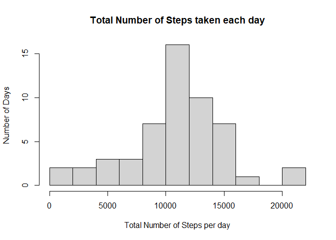
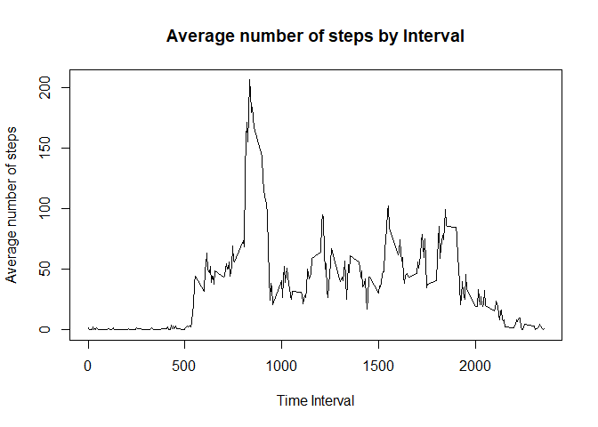
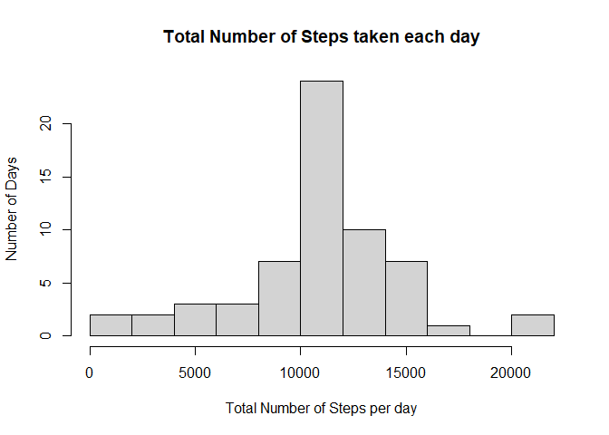
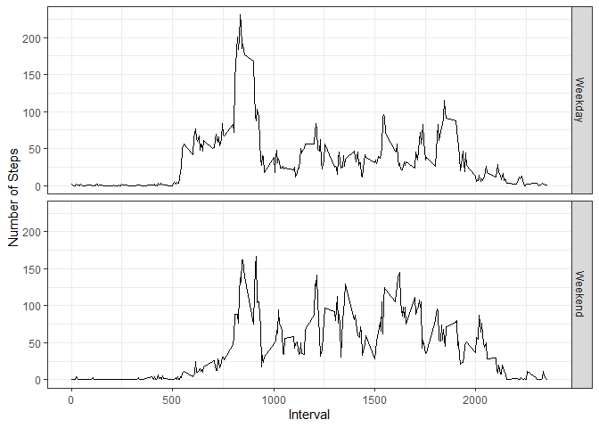

## Loading and preprocessing the data

1. Load the data


```r
data<-read.csv("activity.csv")

str(data)
```

```
## 'data.frame':	17568 obs. of  3 variables:
##  $ steps   : int  NA NA NA NA NA NA NA NA NA NA ...
##  $ date    : chr  "2012-10-01" "2012-10-01" "2012-10-01" "2012-10-01" ...
##  $ interval: int  0 5 10 15 20 25 30 35 40 45 ...
```


2. Process/transform the data (if necessary) into a format suitable for your analysis

```r
data$date <- as.Date(data$date, "%Y-%m-%d")

data_cl <- subset(data, !is.na(data$steps) )

str(data_cl)
```

```
## 'data.frame':	15264 obs. of  3 variables:
##  $ steps   : int  0 0 0 0 0 0 0 0 0 0 ...
##  $ date    : Date, format: "2012-10-02" "2012-10-02" ...
##  $ interval: int  0 5 10 15 20 25 30 35 40 45 ...
```

## What is mean total number of steps taken per day?


1. Calculate the total number of steps taken per day


```r
total_steps <- aggregate(steps~date, data_cl, sum)
```

Make a histogram of the total number of steps taken each day

```r
 hist(total_steps$steps, breaks = 10, xlab="Total Number of Steps per day", ylab="Number of Days", main="Total Number of Steps taken each day")
```

<!-- -->

3. Calculate and report the mean and median of the total number of steps taken per day

```r
mean_st <- mean(total_steps$steps)
```


```r
median_st <- median(total_steps$steps)
```

The mean is 1.0766189\times 10^{4} and the median is 10765.


## What is the average daily activity pattern?

1. Make a time series plot of the 5-minute interval (x-axis) and the average number of steps taken, averaged across all days (y-axis)


```r
ave_steps <- aggregate(steps~interval, data_cl, mean)

plot(ave_steps$interval, ave_steps$steps, type="l", main="Average number of steps by Interval", xlab="Time Interval", ylab="Average number of steps")
```

<!-- -->

2. Which 5-minute interval, on average across all the days in the dataset, contains the maximum number of steps?


```r
line_max_steps <-  which(ave_steps$steps==max(ave_steps$steps))
int_max_steps <- ave_steps$interval[line_max_steps]
max_av_steps <- ave_steps$steps[line_max_steps]
```
 
The interval with the max average 206.1698113 is 835.


## Imputing missing values

1. Calculate and report the total number of missing values in the dataset (i.e. the total number of rows with NAs)


```r
sum(is.na(data))
```

```
## [1] 2304
```

2. Devise a strategy for filling in all of the missing values in the dataset. The strategy does not need to be sophisticated. For example, you could use the mean/median for that day, or the mean for that 5-minute interval, etc.

3. Create a new dataset that is equal to the original dataset but with the missing data filled in.


```r
for (i in 1:nrow(data)) {
    if(is.na(data$steps[i])) {
        val_to_use <- ave_steps$steps[which(ave_steps$interval == data$interval[i])]
        data$steps[i] <- val_to_use
    }
}
```

4. Make a histogram of the total number of steps taken each day and Calculate and report the mean and median total number of steps taken per day. Do these values differ from the estimates from the first part of the assignment? What is the impact of imputing missing data on the estimates of the total daily number of steps?


```r
total_steps_new <- aggregate(steps~date, data, sum)
```


```r
 hist(total_steps_new$steps, breaks = 10, xlab="Total Number of Steps per day", ylab="Number of Days", main="Total Number of Steps taken each day")
```

<!-- -->

3. Calculate and report the mean and median of the total number of steps taken per day

```r
mean_st_new <- mean(total_steps_new$steps)
```


```r
median_st_new <- median(total_steps_new$steps)
```

The mean is 1.0766189\times 10^{4} and the median is 1.0766189\times 10^{4}.


## Are there differences in activity patterns between weekdays and weekends?

1. Create a new factor variable in the dataset with two levels – “weekday” and “weekend” indicating whether a given date is a weekday or weekend day.


```r
for (i in 1:nrow(data)) {
  wkd_val <- weekdays(data$date[i])
  if (wkd_val=='Saturday' || wkd_val == 'Sunday'|| wkd_val=='Samstag' || wkd_val == 'Sonntag' ) {
data$weekday[i] <-  'Weekend'
} else {

data$weekday[i] <-  'Weekday'
    
    }
}
```


```r
data$weekday <- factor(data$weekday)
```


2. Make a panel plot containing a time series plot  of the 5-minute interval (x-axis) and the average number of steps taken, averaged across all weekday days or weekend days (y-axis). See the README file in the GitHub repository to see an example of what this plot should look like using simulated data.


```r
total_steps <- aggregate(steps~interval+weekday, data, mean)
```


```r
library(ggplot2)
```


```r
g <- ggplot(total_steps, aes(interval,steps)) +  geom_line(stat = "identity" ) + theme_bw() +facet_grid(weekday ~ . ~ ., scales="fixed", space="fixed") + labs(x="Interval", y="Number of Steps")

print(g)
```

<!-- -->

